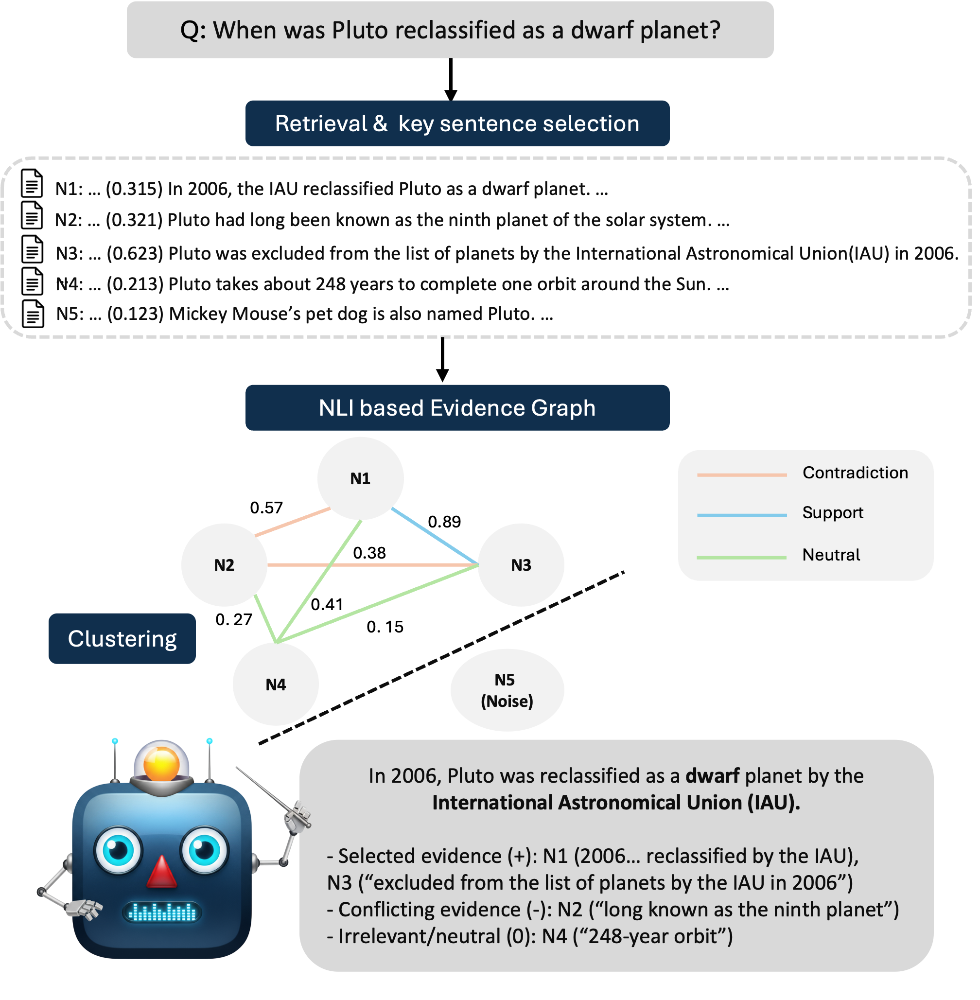

# EG-RAG: Retrieval-Augmented Generation with Evidence Graph for Reliable Multi-Document Reasoning

[](https://opensource.org/licenses/Apache-2.0)
[](https://openreview.net/forum?id=ahosApE8Ap)
[](https://www.python.org/)

Official implementation of **EG-RAG**, accepted at **AAMAS 2026** (The 25th International Conference on Autonomous Agents and Multi-Agent Systems).

## Overview

EG-RAG addresses the challenges of ambiguity, contradiction, misinformation, and noise in real-world retrieval environments by constructing a **sentence-level evidence graph** using Natural Language Inference (NLI) classification.



### Key Features

- **Sentence-level Evidence Graph**: Classifies inter-sentence relations as support, contradiction, or neutral
- **Weighted Integration**: Combines NLI classification probabilities with query-sentence relevance scores
- **Model-agnostic**: Works with various LLM backbones (GPT-4o-mini, Claude Sonnet-4, Ministral-8B)
- **Efficient**: Achieves strong performance with only 1-3 key sentences per document

## Results

EG-RAG achieves significant improvements over standard RAG across multiple benchmarks:

| Benchmark | Improvement over RAG |
|-----------|---------------------|
| FaithEval-Inconsistent | +115.63% |
| HotpotQA | +26.17% |
| RAMDocs | +95.47% |

## Installation

```bash
git clone https://github.com/your-username/eg-rag.git
cd eg-rag
pip install -r requirements.txt
```

Or install as a package:

```bash
pip install -e .
```

## Models & Data References

### Pre-trained Models Used

| Model | Purpose | Source |
|-------|---------|--------|
| `roberta-large-mnli` | NLI Classification | [HuggingFace](https://huggingface.co/roberta-large-mnli) |
| `facebook/bart-large-mnli` | NLI Classification (Alternative) | [HuggingFace](https://huggingface.co/facebook/bart-large-mnli) |
| `microsoft/deberta-v3-large-mnli` | NLI Classification (Alternative) | [HuggingFace](https://huggingface.co/microsoft/deberta-v3-large-mnli) |
| `sentence-transformers/all-MiniLM-L6-v2` | Semantic Embeddings | [HuggingFace](https://huggingface.co/sentence-transformers/all-MiniLM-L6-v2) |

### LLM Backends for Answer Generation

| Provider | Model | Source |
|----------|-------|--------|
| OpenAI | `gpt-4o-mini`, `gpt-4o` | [OpenAI API](https://platform.openai.com/docs/models) |
| Anthropic | `claude-sonnet-4-20250514`, `claude-3-5-sonnet` | [Anthropic API](https://docs.anthropic.com/en/docs/about-claude/models) |
| Ollama (Local) | `mistral:8b`, `llama3`, etc. | [Ollama](https://ollama.com/) |

### Benchmark Datasets

| Dataset | Description | Source |
|---------|-------------|--------|
| FaithEval-Inconsistent | Evaluates handling of conflicting information | [HuggingFace](https://huggingface.co/datasets/Salesforce/FaithEval-inconsistent-v1.0) |
| HotpotQA | Multi-hop question answering | [HuggingFace](https://huggingface.co/datasets/hotpot_qa) |
| RAMDocs | Document consistency evaluation | Paper reference |

## Usage

### Quick Start

```python
from eg_rag import EGRAG

# Initialize EG-RAG with OpenAI (default)
eg_rag = EGRAG(
    nli_model="roberta-large-mnli",
    llm_provider="openai",
    llm_model="gpt-4o-mini",
    top_k=3
)

# Or with Anthropic Claude
eg_rag = EGRAG(
    llm_provider="anthropic",
    llm_model="claude-sonnet-4-20250514",
    top_k=3
)

# Or with local Mistral via Ollama
eg_rag = EGRAG(
    llm_provider="ollama",
    llm_model="mistral:8b",
    top_k=3
)

# Run on a query with documents
documents = """
Document: The Eiffel Tower was completed in 1889 for the World's Fair.
Document: The Eiffel Tower was finished in 1887 for a local exhibition.
"""

answer, evidence_graph = eg_rag.run(
    query="When was the Eiffel Tower completed?",
    documents=documents,
    verbose=True
)

print(f"Answer: {answer}")
# Output: ["1889", "1887"]
```

### Configuration Options

| Parameter | Default | Description |
|-----------|---------|-------------|
| `nli_model` | `roberta-large-mnli` | NLI model for relationship classification |
| `embed_model` | `sentence-transformers/all-MiniLM-L6-v2` | Embedding model for semantic similarity |
| `llm_provider` | `openai` | LLM provider (`openai`, `anthropic`, `ollama`) |
| `llm_model` | Provider default | Model name (e.g., `gpt-4o-mini`, `claude-sonnet-4-20250514`, `mistral:8b`) |
| `llm_base_url` | `None` | Base URL for Ollama (`http://localhost:11434`) |
| `top_k` | `3` | Number of key sentences per document |

### Run Evaluation on Benchmarks

```bash
# Set your OpenAI API key
export OPENAI_API_KEY="your-api-key"

# Run on FaithEval-Inconsistent
python run.py --dataset faitheval --top_k 3 --output results_faitheval.json

# Run on HotpotQA (first 100 samples)
python run.py --dataset hotpotqa --num_samples 100 --top_k 3

# With different NLI model
python run.py --dataset faitheval --nli_model facebook/bart-large-mnli
```

### Varying Key Sentence Count (top_k)

The `top_k` parameter controls how many key sentences are extracted per document:

| top_k | Use Case |
|-------|----------|
| 1 | Fastest, minimal context |
| 2 | Balanced speed/context |
| 3 | Default, good coverage |
| 5 | Maximum context for complex queries |

## Project Structure

```
eg-rag/
├── src/
│   └── eg_rag/
│       ├── __init__.py      # Package exports
│       ├── eg_rag.py        # Main EGRAG class
│       ├── retrieval.py     # Key sentence extraction
│       ├── nli.py           # NLI classification
│       ├── graph.py         # Evidence graph construction
│       ├── prompts.py       # LLM prompt templates
│       ├── llm.py           # LLM client
│       ├── evaluation.py    # Evaluation metrics
│       └── utils.py         # Utility functions
├── run.py                   # Benchmark evaluation script
├── requirements.txt         # Dependencies
├── setup.py                 # Package setup
└── README.md
```

## Environment Setup

Create a `.env` file for API keys:

```bash
OPENAI_API_KEY=your-openai-api-key
# Optional for Anthropic models
ANTHROPIC_API_KEY=your-anthropic-api-key
```

## Requirements

- Python >= 3.9
- PyTorch >= 2.0.0
- CUDA (optional, for GPU acceleration)
- MPS (optional, for Apple Silicon)

## Citation

If you find this code useful for your research, please cite our paper:

```bibtex
@inproceedings{
hong2026egrag,
title={{EG}-{RAG}: Retrieval-Augmented Generation with Evidence Graph for Reliable Multi-Document Reasoning},
author={Seunggwan Hong and Junhyung Moon and Eunkyeong Lee and Jaehyoung Park and Hyunseung Choo},
booktitle={The 25th International Conference on Autonomous Agents and Multi-Agent Systems},
year={2026},
url={https://openreview.net/forum?id=ahosApE8Ap}
}
```

## License

This project is licensed under the Apache License 2.0 - see the [LICENSE](LICENSE) file for details.

## Acknowledgements

This work was supported by Sungkyunkwan University (SKKU) and KT Corporation.
